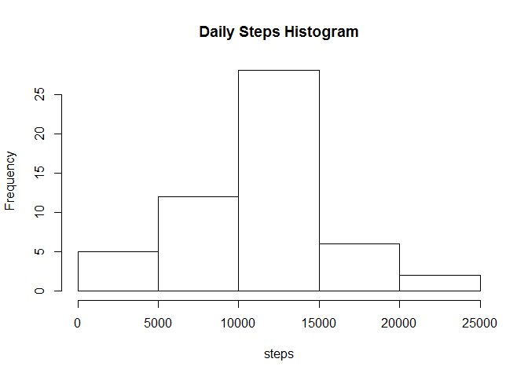
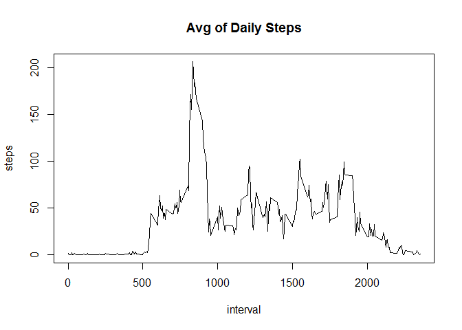
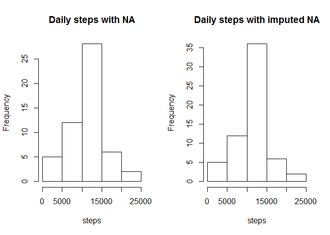

## Introduction

It is now possible to collect a large amount of data about personal movement using activity monitoring devices such as a Fitbit, Nike Fuelband, or Jawbone Up. These type of devices are part of the "quantified self" movement - a group of enthusiasts who take measurements about themselves regularly to improve their health, to find patterns in their behavior, or because they are tech geeks. But these data remain under-utilized both because the raw data are hard to obtain and there is a lack of statistical methods and software for processing and interpreting the data.

This assignment makes use of data from a personal activity monitoring device. This device collects data at 5 minute intervals through out the day. The data consists of two months of data from an anonymous individual collected during the months of October and November, 2012 and include the number of steps taken in 5 minute intervals each day.


FIrst lets define 2 functions


```r
#Function calcavginterval calculate the average number of steps per interval, given a matrix (x) containing steps for specific days

calcavginterval<- function (x) 

{
  d1=unique(x[,3])
  avg<- data.frame(steps=0,interval=rep(0,length(d1)))

  for (i in 1:length(d1))
  {
    avg[i,2]<- d1[i]
    avg[i,1]<- mean(x[x[,3]==d1[i],1])
  }
  avg
}


#Function calsumdays calculate the total number of steps in each day, given a matrix (x) containing steps for specific days

calcsumdays<- function (x) 
{
  d=as.Date(unique(x[,2]))

l=length(d)
sum<- data.frame(steps=0,date=rep(as.Date("1970-01-01"),l))

for (i in 1:l)
{
  sum[i,2]<- d[i]
  sum[i,1]<- sum(x[x[,2]==as.character(d[i]),1])
  } 
sum
}
```


1- Code for reading in the dataset and/or processing the data


```r
setwd("D:/Box Sync/Data Science/Reproducible research")
df<- read.csv("activity.csv")
df_no_na<- df[!is.na(df[,1]),]
```

2-Histogram of the total number of steps taken each day


```r
sum<- calcsumdays(df_no_na)

hist(sum[,1],xlab = "steps", main = "Daily Steps Histogram")
```

<!-- -->

3-Mean and median number of steps taken each day


```r
mean(sum[,1])
```

```
## [1] 10766.19
```

```r
median(sum[,1])
```

```
## [1] 10765
```

4-Time series plot of the average number of steps taken


```r
avg<- calcavginterval(df_no_na)
sum(avg[,1])
```

```
## [1] 10766.19
```

```r
plot(avg[,2],avg[,1],type = "l",xlab = "interval", ylab="steps", main ="Avg of Daily Steps")
```

<!-- -->

5-The 5-minute interval that, on average, contains the maximum number of steps

```r
maxintvalue=max(avg[,1])
maxint=avg[avg[,1]==maxintvalue,2]
maxint
```

```
## [1] 835
```

6-Code to describe and show a strategy for imputing missing data
The startegy here is to fill up the missing interval steps using the average steps matrix (avg) computed previously 


```r
sum(is.na(df$steps))
```

```
## [1] 2304
```

Those missing values consitutes almost 13.6% of the total dataset

Now, fill up the missing values using (avg) matrix


```r
nonNA_m<- df

for (i in 1:dim(nonNA_m)[1])
{
if (is.na(nonNA_m[i,1]))
     {
  nonNA_m[i,1]<-avg[avg[,2]==nonNA_m[i,3],1]   
    }
}  
```

7-Histogram of the total number of steps taken each day after missing values are imputed

```r
sum_noNA<- calcsumdays(nonNA_m)

mean(sum_noNA[,1])
```

```
## [1] 10766.19
```

```r
median(sum_noNA[,1])
```

```
## [1] 10766.19
```

```r
par(mfrow = c(1,2))

hist(sum[,1],xlab = "steps",main="Daily steps with NA")
hist(sum_noNA[,1],xlab = "steps",main="Daily steps with imputed NA")
```

<!-- -->

8-Panel plot comparing the average number of steps taken per 5-minute interval across weekdays and weekends


```r
m1 <- nonNA_m

m1days<- cbind(m1, weekday= !(weekdays(as.Date(m1[,2]))  %in% c("Saturday" ,"Sunday")))

m1wdays=m1days[m1days[,4],]
m1wends=m1days[!m1days[,4],]

avg_m1wdays<- data.frame(calcavginterval(m1wdays),day="Weekday")
avg_m1wends<- data.frame(calcavginterval(m1wends),day="Weekend")

avg_m1<- rbind(avg_m1wdays,avg_m1wends)

library(lattice)

xyplot(steps~interval| day, data = avg_m1,type="l", layout= c(1,2) )
```

<!-- -->

As it is showing in the two plots, for Week days, the activity is mainly at the start of the day and before night. Whereas during Week ends, it is more distributed throghuout the light time hours.
